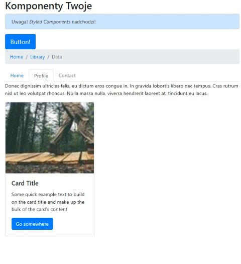

#  React Component Styling Practice

This repository is dedicated to practicing and mastering various styling methods for React components. It focuses on popular techniques like **Styled Components**, **CSS Modules**, **SASS/SCSS**, and traditional **CSS**, highlighting their uses and differences.

**Main features**:
- Learn and implement multiple React styling techniques
- Compare pros and cons of each styling method
- Gain practical experience in organizing styles for scalable applications

&nbsp;

<div style="border: 1px solid #f26e37; padding: 16px; margin-bottom: 30px; border-radius: 8px; box-shadow:  5px 5px  #f26e37;">

## 🔶 Technologies


</div>

<div style="border: 1px solid #f26e37; padding: 16px; margin-bottom: 30px; border-radius: 8px; box-shadow: 5px 5px  #f26e37;">

## 🔶 See also

Are you interested in **React** and **styling techniques**? See my other [project](https://github.com/marazmlab/task-react-styling).

</div>

<div style="border: 1px solid #f26e37; padding: 16px; margin-bottom: 30px; border-radius: 8px; box-shadow: 5px 5px  #f26e37;">

## 🔶 Installation

The project uses [Node.js](https://nodejs.org/en/) and [npm](https://www.npmjs.com/). To run the project locally, follow these steps:

1. Clone the repository:
   ```bash
   git clone https://github.com/devmentor-pl/practice-react-styling.git
   ```

2. Navigate to the project directory:
   ```bash
   cd practice-react-styling
   ```

3. Install dependencies:
   ```bash
   npm install
   ```

4. Start the development server:
   ```bash
   npm start
   ```

The application will be available at `http://localhost:3000`.

</div>

<div style="border: 1px solid #f26e37; padding: 16px; margin-bottom: 30px; border-radius: 8px; box-shadow: 5px 5px  #f26e37;">

## 🔶 Tasks Overview

The project contains several tasks organized in folders `01` to `05`, each demonstrating different styling methods. Below is an overview of the tasks:

- **01** – Create an `<Alert>` component styled with **Styled Components**. The component should support variants like `primary` and `secondary`.
- **02** – Build a `<Button>` component similar to **React Bootstrap**, supporting props like `variant`, `size`, `active`, and `disabled`.
- **03** – Implement a `<Breadcrumb>` component with `<Breadcrumb.Item>` for navigation. It should support `href` and `active` props.
- **04** – Develop `<Tabs>` and `<Tab>` components to manage tabbed content. The active tab should dynamically update the displayed content.
- **05** – Create a `<Card>` component composed of subcomponents like `<Card.Img>`, `<Card.Body>`, `<Card.Title>`, and `<Card.Text>`. Use the previously created `<Button>` component within the card.

Each task includes specific instructions in its respective `README.md` file.

</div>

<div style="border: 1px solid #f26e37; padding: 16px; margin-bottom: 30px; border-radius: 8px; box-shadow: 5px 5px  #f26e37;">

## 🔶 Solutions provided in the project

### Task 01: Alert Component
Styled Components were used to create a dynamic `<Alert>` component. Example:

```jsx
<Alert variant="primary">This is a primary alert!</Alert>
```

### Task 02: Button Component
A reusable `<Button>` component was implemented with support for `variant`, `size`, `active`, and `disabled` props. Example:

```jsx
<Button variant="primary" size="lg">Click Me</Button>
```

### Task 03: Breadcrumb Component
A `<Breadcrumb>` component was created with `<Breadcrumb.Item>` for navigation. Example:

```jsx
<Breadcrumb>
  <Breadcrumb.Item href="#">Home</Breadcrumb.Item>
  <Breadcrumb.Item href="#">Library</Breadcrumb.Item>
  <Breadcrumb.Item active>Data</Breadcrumb.Item>
</Breadcrumb>
```

### Task 04: Tabs Component
A `<Tabs>` component with `<Tab>` subcomponents was implemented to manage tabbed content dynamically. Example:

```jsx
<Tabs defaultActivekey="home">
  <Tabs.Tab eventKey="home" title="Home">Home Content</Tabs.Tab>
  <Tabs.Tab eventKey="profile" title="Profile">Profile Content</Tabs.Tab>
</Tabs>
```

### Task 05: Card Component
A `<Card>` component was built with subcomponents like `<Card.Img>`, `<Card.Body>`, `<Card.Title>`, and `<Card.Text>`. Example:

```jsx
<Card>
  <Card.Img src="image.jpg" alt="Example" />
  <Card.Body>
    <Card.Title>Card Title</Card.Title>
    <Card.Text>Some example text.</Card.Text>
    <Button variant="primary">Go somewhere</Button>
  </Card.Body>
</Card>
```
</div>

<div style="border: 1px solid #f26e37; padding: 16px; margin-bottom: 30px; border-radius: 8px; box-shadow: 5px 5px  #f26e37;">

## 🔶 Conclusions

- **Dynamic styling**: Styled Components were used extensively to enable dynamic and reusable styling across components.
- **Component composition**: Components like `<Card>` and `<Tabs>` were designed with subcomponents for better modularity and reusability.
- **Scalability**: The project demonstrates how to organize styles and components for scalable React applications.
- **Theming**: The use of `ThemeProvider` allows for centralized theme management, making it easier to maintain consistent styling.

This project provides a solid foundation for mastering React component styling techniques.

</div>

<div style="border: 1px solid #f26e37; padding: 16px; margin-bottom: 30px; border-radius: 8px; box-shadow: 5px 5px  #f26e37;">

## 🔶 Feel free to contact me

If you have any questions or feedback, feel free to reach out!  
Find me on [GitHub](https://github.com/marazmlab) or [LinkedIn](https://www.linkedin.com/in/belz/).

</div>

<div style="border: 1px solid #f26e37; padding: 16px; margin-bottom: 30px; border-radius: 8px; box-shadow: 5px 5px  #f26e37;">

## 🔶 Thanks / Special thanks / Credits

Thanks to my [Mentor - devmentor.pl](https://devmentor.pl/) – for providing me with this task and for code review.

</div>

