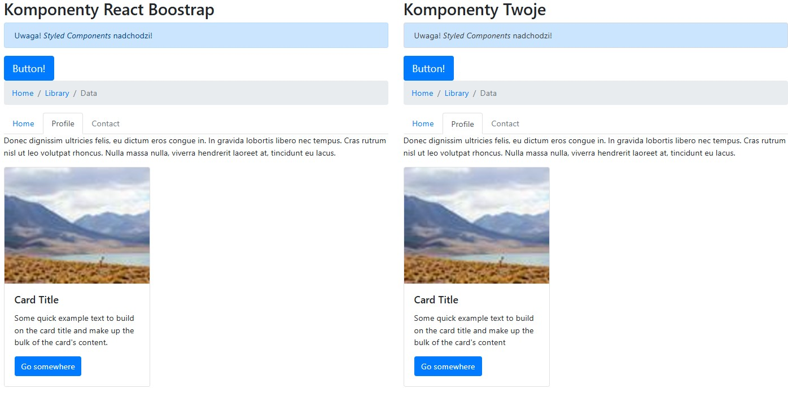

# 🎨 React Component Styling Practice

This repository is dedicated to practicing and mastering various styling methods for React components. It focuses on popular techniques like **Styled Components**, **CSS Modules**, **SASS/SCSS**, and traditional **CSS**, highlighting their uses and differences.

**Main features**:
- Learn and implement multiple React styling techniques
- Compare pros and cons of each styling method
- Gain practical experience in organizing styles for scalable applications
 
## 💡 Technologies


 

## 🔗 See also

Are you interested in **React** and **styling techniques**? See my other [project](https://github.com/marazmlab/task-react-styling).

 

## 💿 Installation

The project uses [Node.js](https://nodejs.org/en/) and [npm](https://www.npmjs.com/). To run the project locally, follow these steps:

1. Clone the repository:
   ```bash
   git clone https://github.com/devmentor-pl/practice-react-styling.git
   ```

2. Navigate to the project directory:
   ```bash
   cd practice-react-styling
   ```

3. Install dependencies:
   ```bash
   npm install
   ```

4. Start the development server:
   ```bash
   npm start
   ```

The application will be available at `http://localhost:3000`.

 

## 📝 Tasks Overview

The project contains several tasks organized in folders `01` to `05`, each demonstrating different styling methods:

- **01** – Styling with Styled Components
- **02** – Using CSS Modules
- **03** – Styling using SASS/SCSS
- **04** – Traditional styling with CSS files
- **05** – Comparison and analysis of different styling methods

Each task includes specific instructions and components to implement or modify.

 

## 🤔 Solutions provided in the project

### Styled Components
Styled Components allow for dynamic and component-based styling. Example:

```jsx
const Button = styled.button`
    background-color: #61dafb;
    border: none;
    padding: 10px 20px;
    border-radius: 5px;
`;
```

### CSS Modules
CSS Modules enable style isolation, preventing class name conflicts. Example:

```css
/* Button.module.css */
.button {
    background-color: #61dafb;
    border: none;
    padding: 10px 20px;
    border-radius: 5px;
}
```

### Comparison of solutions
| **Problem**              | **Solution**                  | **Notes**                     |
|--------------------------|-------------------------------|--------------------------------|
| Style reusability        | CSS Modules, SASS             | Great for large projects      |
| Dynamic styling          | Styled Components             | Ideal for components          |
| Project scalability      | Modular organization of styles| Important for team projects   |

### Example of dynamic styling
Dynamic styling can be achieved using Styled Components:

```jsx
const DynamicButton = styled.button`
    background-color: ${(props) => props.primary ? '#61dafb' : '#ccc'};
`;
```

### Conclusions
- **Dynamic styling**: Styled Components are the best choice for this purpose.
- **Code organization**: It is worth using a consistent folder structure and exploring tools like TailwindCSS.

 

## 🙋‍♂️ Feel free to contact me

If you have any questions or feedback, feel free to reach out!  
Find me on [GitHub](https://github.com/marazmlab) or [LinkedIn](https://www.linkedin.com/in/belz/).


## 👏 Thanks / Special thanks / Credits

Thanks to my [Mentor - devmentor.pl](https://devmentor.pl/) – for providing me with this task and for code review.

 

